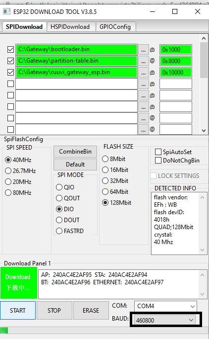

# Ruuvi Gateway ESP32 firmware

Developed with:
* ESP-IDF version [v4.0.1](https://github.com/espressif/esp-idf/releases/tag/v4.0.1)
* ESP32-DevKitC V4
* Waveshare LAN8720 ETH board
* nRF52832 devkit

or Ruuvi Gateway A1 boards, contact lauri@ruuvi.com for details on how to get one. 

### Features

Latest documentation and roadmap is at https://docs.ruuvi.com/gw-esp32-firmware . 

### IO pins for devkit:

ESP32 | Function
--|--
2 | Reset button
4 | UART TX
5 | UART RX

### Ethernet:
ESP32 | LAN87210
-|-
0 | nINT/REFCLK
23 | NC/CLOCK_ENABLE*
15 | MDC
18 | MDIO
19 | TX0
21 | TX_EN
22 | TX1
25 | RX0
26 | RX1
27 | CRS/RX_DV

** ESP32 will use external clock signal from LAN8720 and some modifications are needed for that: **
* [WaveShare LAN8720 modification for clock](https://sautter.com/blog/ethernet-on-esp32-using-lan8720/)
* Remove capacitor C15 from onboard Boot button (SW1) to make clock signal work from LAN8720

### nRF52 firmware
nRF52 firmware can run on PCA10040/nRF52832 or on nRF52811 on Ruuvi Gateway. You can find the latest firmware at https://github.com/ruuvi/ruuvi.gateway_nrf.c. 

### Build and Flash

Run `git submodule update --init --recursive` to get updated components. 
Project configuration is stored in sdkconfig-file, you don't need to reconfigure it. 
Build the project and flash it to the board, then run monitor tool to view serial output:

```
idf.py build
idf.py -p PORT flash monitor
```

(To exit the serial monitor, type ``Ctrl-]``.)

See the [Getting Started Guide](https://docs.espressif.com/projects/esp-idf/en/latest/esp32/get-started/) for full steps to configure and use ESP-IDF to build projects.

### Using prebuilt images
Prebuilt images for development versions of firmware can be found at [Ruuvi Jenkins](https://jenkins.ruuvi.com/job/ruuvi_gateway_esp-PR/). However these are artifacts of internal development, if you want to just use the gateway you should use [release](https://github.com/ruuvi/ruuvi.gateway_esp.c/releases) starting from 1.x+. First release is estimated to be ready on 7/2020. 

You can flash them with idf.py or using Windows GUI tool with these settings:


